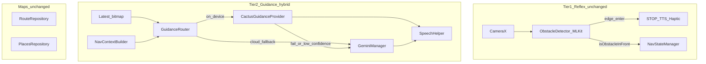

# Cactus Integration Roadmap (GuideGlass)

**Status:** Planned / deferred  
**Prerequisite reading:** [docs/CACTUS_EVALUATION.md](docs/CACTUS_EVALUATION.md)  
**Official docs:** [Cactus Android & Kotlin SDK](https://docs.cactuscompute.com/latest/android/) · [cactus-kotlin on GitHub](https://github.com/cactus-compute/cactus-kotlin)

## Goals (what success looks like)

- **Keep Tier 1 unchanged:** [ObstacleDetector.kt](app/src/main/java/com/impairedvision/guideglass/vision/ObstacleDetector.kt) (ML Kit) remains the only STOP/haptic reflex path.
- **Augment Tier 2:** Route _non-urgent_ scene guidance through Cactus on-device when quality/latency wins; fall back to [GeminiManager.kt](app/src/main/java/com/impairedvision/guideglass/ai/GeminiManager.kt) when not.
- **Preserve existing gates:** `geminiInFlight` in [VisionActivity.kt](app/src/main/java/com/impairedvision/guideglass/vision/VisionActivity.kt) and `isAnalyzing` in [NavigationViewModel.kt](app/src/main/java/com/impairedvision/guideglass/viewmodel/NavigationViewModel.kt) become router-level locks—no parallel unguarded inference.
- **Reuse nav context:** [NavContextBuilder.kt](app/src/main/java/com/impairedvision/guideglass/ai/NavContextBuilder.kt) + `NavStateManager.isObstacleInFront` feed both Cactus and Gemini prompts.
- **Do not replace:** Google Maps, Directions, Places, or ML Kit without separate proof.

## Non-goals (this roadmap)

- Replacing ML Kit reflex in early phases.
- Removing Gemini entirely.
- Fixing Combined Mode startup (orthogonal; see [android-performance](.cursor/agents/android-performance.md) agent).

## Target architecture (end state)

**New modules (planned files):**

| File                                          | Role                                                                     |
| --------------------------------------------- | ------------------------------------------------------------------------ |
| `app/.../ai/GuidanceRouter.kt`                | Policy: when on-device vs cloud; owns in-flight gate                     |
| `app/.../ai/CactusGuidanceProvider.kt`        | Wraps Cactus completion + image prompt assembly                          |
| `app/.../ai/GuidanceProvider.kt`              | Interface: `suspend fun analyze(bitmap, navContext, goal): Flow<String>` |
| `app/.../GuideGlassApplication.kt` (optional) | `CactusContextInitializer.initialize()` once per process                 |
| `docs/CACTUS_IMPLEMENTATION_LOG.md`           | Per-phase checklist + benchmark notes (created in Phase 0)               |

**Integration seam:** Replace direct calls in `maybeLaunchGemini` / `NavigationViewModel.triggerGeminiAnalysis` with `guidanceRouter.analyze(...)`.

---

## Phase 0 — Due diligence and go/no-go (1–2 days)

**Owner skill:** Research + [code-auditor](.cursor/agents/code-auditor.md) review of constraints.

**Tasks:**

1. Read [Cactus Android docs](https://docs.cactuscompute.com/latest/android/) and [cactus-kotlin README](https://github.com/cactus-compute/cactus-kotlin).
2. Confirm compatibility with GuideGlass:
   - minSdk **26** vs Cactus **API 24+** (OK).
   - **ABI:** Cactus emphasizes **arm64-v8a**; project also filters x86 emulators in [app/build.gradle.kts](app/build.gradle.kts)—document “Cactus on physical device only” or obtain x86 libs if offered.
   - APK size + model download strategy (on first launch vs bundled).
3. Inventory Cactus models: identify any **vision-language** model suitable for “veer left / traffic light / path clear” vs speech-only (Whisper).
4. Legal/commercial: pricing, `CACTUS_CLOUD_KEY` data handling, offline-only mode claims.
5. Create [docs/CACTUS_IMPLEMENTATION_LOG.md](docs/CACTUS_IMPLEMENTATION_LOG.md) with go/no-go checklist and device matrix (same phones used for ML Kit street tests).

**Exit criteria:** Written go/no-go; if no on-device VLM fits Tier 2, limit roadmap to **Phase 5 (STT only)** or pause.

---

## Phase 1 — SDK spike and dev wiring (2–4 days)

**Owner skills:** [android-performance](.cursor/agents/android-performance.md), minimal [gemini-pipeline](.cursor/agents/gemini-pipeline.md).

**Tasks:**

1. **Dependency** (preferred path per [cactus-kotlin](https://github.com/cactus-compute/cactus-kotlin)):
   - Add Maven repo + `implementation("com.cactuscompute:cactus:…")` in [app/build.gradle.kts](app/build.gradle.kts) (pin exact version from docs at implementation time).
   - Alternative: manual `libcactus.so` + `Cactus.kt` per [Android integration guide](https://docs.cactuscompute.com/latest/android/).
2. **Secrets:** Extend [local.properties.example](local.properties.example) with `CACTUS_CLOUD_KEY=`; inject via existing `localProp()` pattern (mirror `GEMINI_API_KEY`).
3. **Lifecycle init:** Call `CactusContextInitializer.initialize(context)` from new `GuideGlassApplication` or `MainActivity`/`VisionActivity` `onCreate` (once per process).
4. **Manifest:** Ensure `INTERNET` (already present); add `RECORD_AUDIO` only if Phase 5 is confirmed.
5. **Spike screen** (debug-only): Download one small model; run text `complete()` and log latency—no GuideGlass UI changes.
6. **Cold start benchmark:** Measure app launch with/without Cactus native load ([android-performance](.cursor/agents/android-performance.md) profiler).

**Exit criteria:** Debug build runs on arm64 device; model loads; one successful on-device completion; cold-start delta documented.

---

## Phase 2 — Shadow mode (3–5 days)

**Owner skills:** [gemini-pipeline](.cursor/agents/gemini-pipeline.md), [mlkit-reflex](.cursor/agents/mlkit-reflex.md) (ensure no reflex coupling).

**Tasks:**

1. Implement `CactusGuidanceProvider` behind a feature flag `CACTUS_SHADOW_MODE=true` (BuildConfig or `local.properties` debug flag).
2. On each Tier-2 trigger in [VisionActivity.kt](app/src/main/java/com/impairedvision/guideglass/vision/VisionActivity.kt) (`maybeLaunchGemini`):
   - Continue **production path:** Gemini only (user hears Gemini).
   - **Shadow path:** Also run Cactus in parallel on `Dispatchers.IO`; log:
     - chosen route (if policy simulated)
     - latency
     - output text
     - nav context hash / `isObstacleInFront`
3. Record 20–30 labeled street clips + nav contexts; offline diff Cactus vs Gemini outputs (quality rubric: actionable, &lt;12 words, no erroneous STOP).
4. **Do not** change TTS or user-visible behavior.

**Exit criteria:** Report in `CACTUS_IMPLEMENTATION_LOG.md`: % frames where Cactus output is “acceptable”; p50/p95 latency vs Gemini; list of failure modes (traffic lights, obstacles, nav metadata ignore).

---

## Phase 3 — Router abstraction (2–3 days)

**Owner skills:** [gemini-pipeline](.cursor/agents/gemini-pipeline.md), [code-auditor](.cursor/agents/code-auditor.md).

**Tasks:**

1. Add `GuidanceProvider` interface and `GuidanceRouter`:
   - Inputs: `Bitmap`, `NavContextBuilder` string, `activeUserGoal`, `isObstacleInFront`.
   - Single `AtomicBoolean` in-flight guard (replaces duplicate semantics—collapse with `geminiInFlight` naming).
2. Refactor [VisionActivity.kt](app/src/main/java/com/impairedvision/guideglass/vision/VisionActivity.kt):
   - `maybeLaunchGemini` → `maybeLaunchGuidance`.
   - `analyzeWithGemini` → router call.
3. Refactor [NavigationViewModel.kt](app/src/main/java/com/impairedvision/guideglass/viewmodel/NavigationViewModel.kt) to use same router when wired to UI (future MapsActivity adoption).
4. **Policy v1 (simple):**
   - If `!analysisEnabled` or in-flight → skip.
   - If offline or `FORCE_ON_DEVICE` → Cactus.
   - Else if `isObstacleInFront` or `activeUserGoal != null` → Gemini (hard scenes).
   - Else → try Cactus; on empty/error/low confidence → Gemini.

**Exit criteria:** Unit-testable router; Gemini-only behavior when flag off; no behavior change with `CACTUS_ENABLED=false`.

---

## Phase 4 — Hybrid Tier 2 enabled (5–8 days)

**Owner skills:** [gemini-pipeline](.cursor/agents/gemini-pipeline.md), [google-maps-navigation](.cursor/agents/google-maps-navigation.md) for nav context validation.

**Tasks:**

1. Enable `CACTUS_ENABLED=true` for internal builds.
2. Prompt parity: Port [GeminiManager.kt](app/src/main/java/com/impairedvision/guideglass/ai/GeminiManager.kt) system rules into Cactus system/message template (especially `isObstacleInFront` path-around rule).
3. Image pipeline: Reuse 320×320 JPEG scaling from GeminiManager or extract shared `FrameEncoder.kt`.
4. Streaming: If Cactus supports token streaming, mirror `handleGeminiFinalResponse`; else speak only final string (document UX difference).
5. Preserve **obstacle-enter bypass:** `bypassThrottle = true` still triggers router (Cactus first per policy, Gemini fallback).
6. Field test all three modes: Vision-only, Navigation-only (when VM wired), Combined.
7. Run [code-auditor](.cursor/agents/code-auditor.md) on touched files.

**Exit criteria:** Acceptable guidance in field tests; Gemini fallback verified; no reflex regression; cost estimate (Gemini calls reduced vs baseline).

---

## Phase 5 — Optional: Cactus speech for voice destinations (4–6 days)

**Owner skills:** [google-maps-navigation](.cursor/agents/google-maps-navigation.md), [android-performance](.cursor/agents/android-performance.md).

**Tasks:**

1. Prototype STT in [VoiceCommandManager.kt](app/src/main/java/com/impairedvision/guideglass/voice/VoiceCommandManager.kt) flow via Cactus transcription API (see cactus-kotlin example: Whisper).
2. Hybrid audio routing: clear audio → on-device; noisy → cloud (Cactus claim—validate outdoors).
3. Wire to existing `startVoiceCommand()` in VisionActivity; keep regex parser unchanged initially.
4. Add `RECORD_AUDIO` permission UX if not already granted in combined mode.

**Exit criteria:** Hands-free “navigate to …” works in moderate noise; fallback documented.

---

## Phase 6 — Hardening and cleanup (3–5 days)

**Owner skills:** [android-performance](.cursor/agents/android-performance.md), [code-auditor](.cursor/agents/code-auditor.md).

**Tasks:**

1. Feature flags: `CACTUS_ENABLED`, `CACTUS_SHADOW_MODE`, `FORCE_ON_DEVICE` via BuildConfig from `local.properties`.
2. Evaluate removing unused **MediaPipe / TFLite** deps in [app/build.gradle.kts](app/build.gradle.kts) if Cactus replaces experimental on-device paths—or keep if still unused and size acceptable.
3. Update [README.md](README.md): link to `CACTUS_EVALUATION.md`, setup keys, phased rollout note.
4. Battery/thermal profiling during 15-min combined-mode walk.
5. Error surfaces: user-facing “offline guidance” vs “analysis error” strings.

**Exit criteria:** Release checklist; README accurate; no new critical audit findings.

---

## Phase 7 — Production rollout (ongoing)

**Tasks:**

1. Staged rollout: internal → beta → default on with Gemini fallback always available.
2. Monitor: Gemini API usage drop, crash-free sessions, user feedback on wrong guidance.
3. Revisit policy weights using shadow logs from Phase 2.

---

## Risk register (carry through all phases)

| Risk                       | Mitigation                                                |
| -------------------------- | --------------------------------------------------------- |
| Worse guidance than Gemini | Shadow Phase 2; Gemini always fallback in Phase 4         |
| arm64-only Cactus          | Test on physical devices; document emulator limitation    |
| APK bloat                  | Model-on-demand download; measure in Phase 1              |
| Duplicate inference stacks | Single `GuidanceRouter`; never second detector for reflex |
| API key proliferation      | `local.properties` only; never commit keys                |

## Suggested subagent map per phase

| Phase | Primary agents                              |
| ----- | ------------------------------------------- |
| 0     | codebase-teacher (explain), code-auditor    |
| 1     | android-performance                         |
| 2     | gemini-pipeline, mlkit-reflex               |
| 3–4   | gemini-pipeline, code-auditor               |
| 5     | google-maps-navigation, android-performance |
| 6–7   | android-performance, code-auditor           |

## When you resume implementation

1. Open this plan and `CACTUS_IMPLEMENTATION_LOG.md`.
2. Complete Phase 0 go/no-go before writing production code.
3. Use feature flags so `main` stays shippable with Cactus disabled until Phase 4 sign-off.
