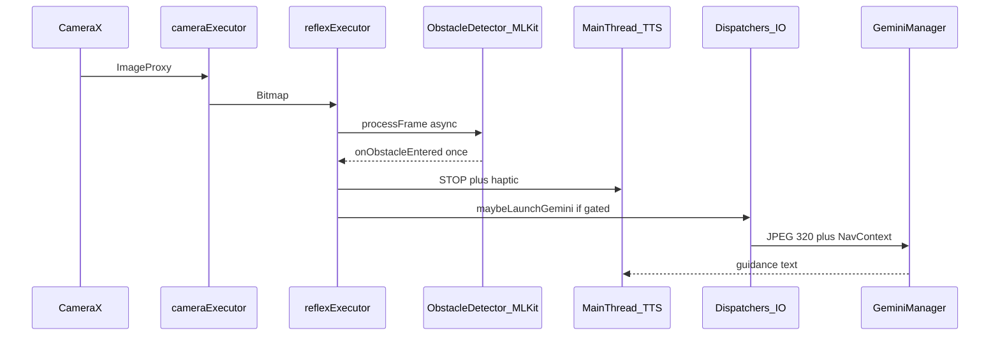
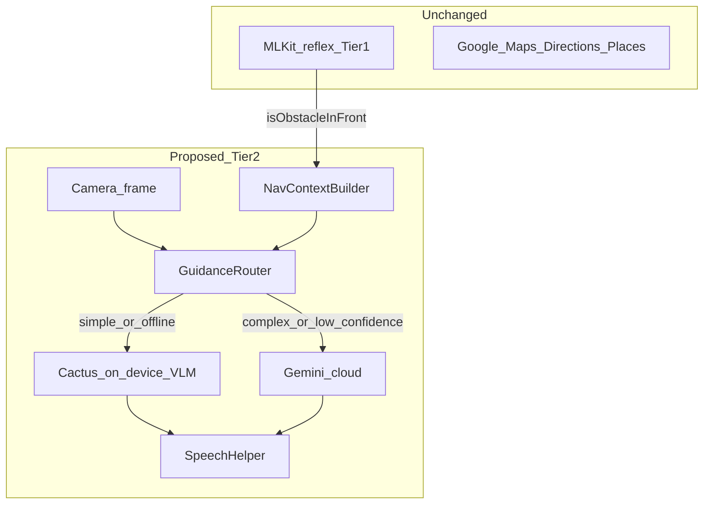
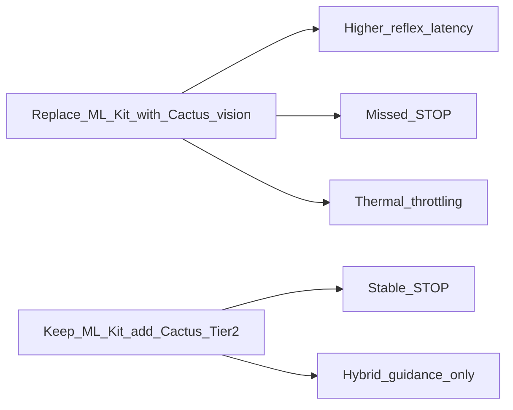
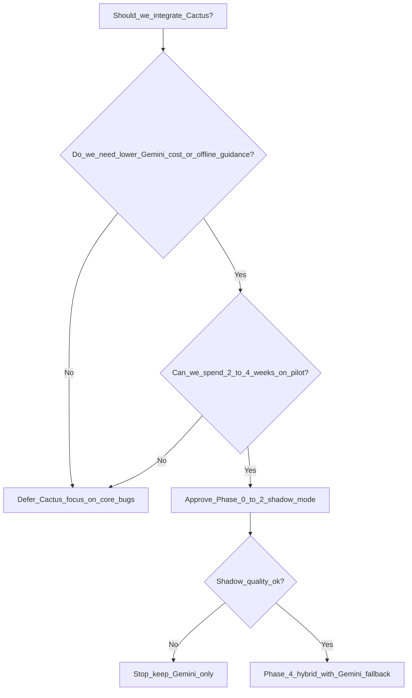

# GuideGlass Group Lesson: Cactus Compute and Our App

**Audience:** GuideGlass project teammates (mixed technical levels welcome)  
**Format:** Codebase-teacher style — explain first, diagram second, debate third  
**Duration:** 90–120 minutes (flexible; modules can be split across two meetings)  
**Prerequisites:** Skim [README.md](../README.md) and optionally [guideglass_technical_deep_dive.md](../guideglass_technical_deep_dive.md)

**Companion docs (do not present all in one sitting):**

- [CACTUS_EVALUATION.md](CACTUS_EVALUATION.md) — technical fit analysis  
- [.cursor/plans/cactus_integration_roadmap_5f258d85.plan.md](../.cursor/plans/cactus_integration_roadmap_5f258d85.plan.md) — phased implementation when we are ready  
- [Cactus Compute homepage](https://www.cactuscompute.com/) — vendor positioning  
- [Cactus Android SDK docs](https://docs.cactuscompute.com/latest/android/) — integration reality  

---

## How to use this lesson plan

| Role | What to do |
|------|------------|
| **Presenter** | Follow modules in order; use “Discussion” boxes for group input |
| **Note-taker** | Capture decisions in a shared doc: go / no-go / pilot-only / defer |
| **Skeptic** | Ask “what breaks for a blind user if this is wrong?” every module |
| **Android dev** | Map each concept to files under `app/src/main/java/com/impairedvision/guideglass/` |

**Teaching principle (from our codebase-teacher agent):** No jargon without a definition. Every claim about Cactus should be tagged **Vendor claim** vs **GuideGlass fact** vs **Unknown — must test**.

---

## Learning objectives

By the end of this session, teammates should be able to:

1. Explain what [Cactus Compute](https://www.cactuscompute.com/) sells in one paragraph (on-device runtime + hybrid cloud router).
2. Draw GuideGlass’s **two-tier** pipeline (ML Kit reflex vs Gemini reasoning) and show where Cactus could sit **without** replacing maps or STOP alerts.
3. List **three concrete benefits** and **three concrete risks** for *our* accessibility use case.
4. Answer: “Is Cactus a migration away from Gemini?” (**No — it is an optional layer with fallback.**)
5. Describe what a safe pilot would look like (shadow mode → hybrid Tier 2 only → keep ML Kit).

---

## Module 0 — Icebreaker: what problem are we solving? (10 min)

### Short answer

GuideGlass helps visually impaired users walk safely using **camera + maps + voice**. We already split safety into **fast reflex** (STOP) and **slow reasoning** (directional guidance). Cactus is a **vendor toolkit** that might make the slow path cheaper, faster, or more offline — not a new app by itself.

### GuideGlass facts (our repo today)

| Mode | User action | What runs |
|------|-------------|-----------|
| Vision | `MainActivity` → Vision | Camera + ML Kit reflex + Gemini |
| Navigation | `MainActivity` → Maps | Google Maps + Directions + TTS |
| Combined | Vision + map split | All of the above in `VisionActivity.kt` |

Key files to open during discussion:

- `vision/ObstacleDetector.kt` — Tier 1  
- `ai/GeminiManager.kt` — Tier 2  
- `ai/NavContextBuilder.kt` — structured text sent with each Gemini image  
- `vision/VisionActivity.kt` — `maybeLaunchGemini`, `geminiInFlight`  

### Discussion prompts

1. What user-visible failure hurts most today: **late STOP**, **wrong guidance**, **no guidance offline**, or **API cost**?  
2. Are we optimizing for a **class demo**, **research paper**, or **daily dogfood**? Priority changes the Cactus decision.

---

## Module 1 — What is Cactus? (Vendor deep dive) (20 min)

### 1.1 Short answer (from [cactuscompute.com](https://www.cactuscompute.com/))

Cactus Compute positions itself as **“On-device AI with cloud fallback.”** You deploy **speech, vision, and text models** with **one toolkit**. Their headline promise: **cloud accuracy without paying cloud prices for every request**, by routing easy work to the phone and hard work to the cloud automatically.

They are **backed by Y Combinator** and highlight team alumni from **University of Oxford, DeepRender, Salesforce, Google, AWS, Washington Post, MIT** (homepage credibility signal — not a technical guarantee).

### 1.2 The two demos they want you to imagine

#### Demo A — Transcription / audio routing

**Vendor narrative:** “Cactus automatically routes audio between on-device for **clear audio** and cloud for **noisy data**.”

On their live UI metaphor:

- **Cactus Hybrid Router** chooses **On-Device** vs **Cloud**  
- Example shown latency: **120 ms** (on-device path)  
- CLI hooks they advertise:  
  ```bash
  brew install cactus-compute/cactus/cactus
  cactus transcribe
  ```

**Relevance to GuideGlass:** We do **not** yet run continuous on-device STT for destinations; we use regex + Places/geocoder in `voice/VoiceCommandManager.kt`. Cactus is a **future** fit for hands-free “navigate to …” in noisy streets.

#### Demo B — Agent / tool complexity routing

**Vendor narrative:** “Cactus routes agent commands based on **complexity**: on-device for **simple** tasks, cloud for **complex** operations.”

Example command on site: *“Set the thermostat to 72 degrees”* — simple enough for on-device.

CLI: `cactus run`

**Relevance to GuideGlass:** Our Tier-2 task is **not** a thermostat tool call. It is **multimodal navigation coaching** with a camera image + compass/GPS block. Complexity routing is **analogous** but not identical.

### 1.3 Headline metrics (vendor claims — verify in pilot)

| Metric | Value on homepage | What it implies |
|--------|-------------------|-----------------|
| Cost savings | **5×** | If ~80%+ of inference can stay on-device (they state this for production transcription + LLM) |
| On-device latency | **&lt;120 ms** | Subjective “real-time” for audio; vision may differ |
| Transcription WER | **&lt;6%** | Strong if true for *their* benchmark conditions |
| API surface | **“1 API”** | Single toolkit for speech, vision, text — integration simplification story |

**Teaching note:** Latency for **vision-language** guidance on a walking user is the metric that matters for us — not transcription WER alone.

### 1.4 Cactus Engine (what runs under the hood)

From the homepage **“Powered by the Cactus Engine”** section:

| Feature | Vendor description | Why teams care |
|---------|-------------------|----------------|
| **Open Source** | “Fully auditable and community-driven” — clone `github.com/cactus-compute/cactus`, `source ./setup`, `cactus build`, `cactus run LiquidAI/LFM2-2.6B` | Safety-critical apps want inspectable native code |
| **Optimized execution** | Quantized models + hardware-specific acceleration; battery-efficient | We already rejected MiDaS for **thermal/blocking** — battery story matters |
| **Zero-copy memory mapping** | Minimal RAM, near-instant model load | Cold start and Combined Mode hang sensitivity |
| **Cross-platform** | iOS, Android, macOS, wearables; SDKs: Python, React Native, **Swift, Kotlin**, Flutter, C++ | Matches our Kotlin stack |

### 1.5 Cactus Hybrid Cloud (Python example on site)

Homepage shows:

```python
import os
from src.cactus import cactus_init, cactus_complete

os.environ["CACTUS_CLOUD_KEY"] = "your-api-key"

model = cactus_init("weights/qwen3-600m", None, False)
result = cactus_complete(model, messages, None, None, None)
```

**Takeaways for the group:**

- Hybrid mode needs a **`CACTUS_CLOUD_KEY`** (another secret beside our `GEMINI_API_KEY` in `local.properties`).  
- They ship **small models** (example: **Qwen3-600M**) on-device — not Gemini-class multimodal by default.  
- “Messages” API is **LLM-style JSON**, similar in spirit to our Gemini prompts — but **different model behavior**.

### 1.6 Hybrid Cloud product principles (website wording)

| Principle | Website language | GuideGlass translation |
|-----------|------------------|------------------------|
| **Automatic handoff** | Monitors conditions (e.g. audio quality); “your app doesn’t need to know the difference” | We would still need a **policy** for vision: when to trust on-device scene text |
| **Privacy** | Lock to on-device only; “HIPAA-friendly, GDPR-compliant, zero data retention” | Strong story for a **privacy mode** — legal review required |
| **Cost** | “Over 80% of production transcription and LLM inference can be handled on-device” | If true, Gemini bill drops — if untrue, we add complexity for nothing |

### 1.7 “No compromise” comparison table (their framing)

Cactus publishes a feature matrix (paraphrased from homepage):

| Capability | Traditional Cloud AI | Cactus On-Device | Cactus Hybrid |
|------------|------------------------|------------------|---------------|
| Sub 150 ms latency | — | Yes | Yes |
| Handles noisy audio | — | — | Yes |
| Works offline | — | Yes | Partial |
| Data privacy | — | Yes | Partial |
| Cost efficient | — | Yes | Yes |
| Smart routing | — | — | Yes |

**Critical thinking prompt:** “Works offline” for **maps** is still **false** — Google Directions needs network. Hybrid helps **guidance sentences**, not **routing geometry**.

### 1.8 Edge product categories they target

| Segment | Website use case | Parallel in GuideGlass |
|---------|------------------|------------------------|
| Mobile voice assistant | Real-time commands, sub-150 ms | Future voice destinations |
| Desktop notetaker | Transcription | Not our focus |
| Wearable intelligence | Smart glasses, battery | Long-term hardware story |

### 1.9 Glossary (Module 1)

| Term | Definition |
|------|------------|
| **On-device inference** | Model runs on the phone CPU/NPU; no network round-trip for that step |
| **Hybrid routing** | Framework chooses device vs cloud per request |
| **WER** | Word Error Rate — speech recognition accuracy metric |
| **Quantization** | Compressed model weights (smaller/faster; may reduce quality) |
| **Zero-copy mapping** | Loading model weights without extra RAM copies |

### Discussion (Module 1)

1. Which homepage claim matters most for blind pedestrians: **latency**, **privacy**, or **cost**?  
2. Do we trust “**your app doesn’t need to know the difference**,” or do we want explicit logging for debugging wrong guidance?

---

## Module 2 — GuideGlass architecture refresher (15 min)

### 2.1 Short answer

GuideGlass is a **two-tier safety system** plus **Google navigation**. Cactus only touches the **reasoning tier** in current plans — **not** STOP reflex, **not** maps.

### 2.2 Diagram — today’s pipeline



### 2.3 Tier 1 — Reflex (GuideGlass fact)

- File: `vision/ObstacleDetector.kt`  
- Engine: **Google ML Kit** `ObjectDetection`, `STREAM_MODE`  
- Logic: center path (30–70% width) + bottom-edge proximity (~80% frame height)  
- Alert semantics: **edge-triggered** — one STOP on enter; silent while obstacle remains; re-arm after clear  
- State export: `NavStateManager.isObstacleInFront` for Gemini context  

**Analogy:** Tier 1 is the **airbag** — must fire in milliseconds, cannot wait for Wi‑Fi.

### 2.4 Tier 2 — Reasoning (GuideGlass fact)

- Files: `ai/GeminiManager.kt`, `vision/VisionActivity.kt` (`maybeLaunchGemini`)  
- Engine: **Google Gemini** (`generativeai` SDK), cloud-only today  
- Input: downscaled camera JPEG + `NavContextBuilder` block (compass, travel verdict, next step, `isObstacleInFront`)  
- Gate: `geminiInFlight` `AtomicBoolean` — only one cloud analysis at a time  
- Typical latency: **~1.5–3 s** (internal deep dive)  

**Analogy:** Tier 2 is the **orientation and mobility instructor** — explains how to walk around what Tier 1 already flagged.

### 2.5 What we explicitly removed (history lesson)

**MiDaS V2** on-device depth was removed because:

- ~**200 ms/frame** blocking work  
- **Thermal** throttling on phones  
- **Relative depth only** — flat wall far away could look “close”  

**Teaching point:** When evaluating Cactus, ask: “Are we repeating MiDaS failure mode or avoiding it?” Cactus claims **battery-efficient + zero-copy** — that must be **profiled**, not believed.

### 2.6 Maps layer (unchanged by Cactus)

- `maps/MapsActivity.kt`, Directions via `RetrofitClients`, Places, `NavStateManager`  
- Network required for routes — **Cactus does not replace this**

### Discussion (Module 2)

1. Why would it be dangerous to route **STOP** through a 120 ms **LLM** path?  
2. Where should `isObstacleInFront` live if both Cactus and Gemini need it?

---

## Module 3 — What “Cactus migration” would and would NOT mean (15 min)

### 3.1 Short answer

**“Migration” is a misleading word.** We are not swapping databases. We are considering adding a **GuidanceRouter** that tries **Cactus on-device first**, then **Gemini fallback** — similar in spirit to Cactus Hybrid Cloud.

### 3.2 Diagram — proposed hybrid (future)



### 3.3 What would change in the product

| User experience | Without Cactus | With Cactus hybrid (if successful) |
|-----------------|----------------|-----------------------------------|
| STOP alert | Same ML Kit | **Same** (planned) |
| Turn-by-turn map | Same Google | **Same** |
| Scene guidance after STOP | Gemini cloud, 1.5–3 s | Often faster on-device; cloud when hard |
| Offline walking | ML Kit works; Gemini silent | Possible **short** guidance offline |
| Privacy story | Images leave device for Gemini | Optional **on-device-only** reasoning mode |
| Developer keys | `GEMINI_API_KEY`, Maps keys | + `CACTUS_CLOUD_KEY` |

### 3.4 What would NOT change

- Google Maps UI, polylines, step index logic  
- ML Kit bounding-box reflex (unless a **separate** high-risk project)  
- Android TTS output (`tts/SpeechHelper.kt`) — Cactus does **not** speak; we still speak results  
- Accessibility requirement: guidance must stay **short, actionable** (Gemini system prompt: under ~12 words)

### 3.5 Android integration specifics ([docs](https://docs.cactuscompute.com/latest/android/))

Facts for the Android developers in the room:

| Topic | Documentation detail | Implication for GuideGlass |
|-------|---------------------|----------------------------|
| **Min SDK** | Android API **21+**, **arm64-v8a** | We are minSdk **26** — OK |
| **Binary** | `libcactus.so` in `jniLibs/arm64-v8a/` or Maven `com.cactuscompute:cactus` (see [cactus-kotlin](https://github.com/cactus-compute/cactus-kotlin)) | Emulator x86 may **not** run Cactus — test on physical phones |
| **Init** | `cactusInit(modelPath, corpusDir, cacheIndex)` returns `Long` handle | Need model download strategy (Hugging Face weights mentioned: `huggingface.co/Cactus-Compute`) |
| **Vision models** | Docs: **LFM2-VL, LFM2.5-VL, Gemma4, Qwen3.5** — add `"images": ["path.png"]` to messages JSON | This is the closest match to our Gemini image+text pipeline |
| **Completion API** | `cactusComplete(model, messagesJson, optionsJson, toolsJson, callback)` | Parallel to `generateContentStream` |
| **Streaming** | Token callback in `cactusComplete` | Can mirror our stream-then-speak pattern |
| **Transcription** | `cactusTranscribe`, streaming variants, custom vocabulary bias | Future voice module |
| **Prefill / tools** | `cactusPrefill` + tool JSON for agentic flows | Probably **out of scope** for v1 |

Example from docs (vision message shape — **illustration only**):

```json
{"role":"user","content":"Describe path ahead","images":["/path/to/frame.jpg"]}
```

### Discussion (Module 3)

1. Are we comfortable shipping **arm64-only** Cactus for a class project if emulators are x86?  
2. Who owns **model selection** (which VL model on device)?

---

## Module 4 — Benefits for GuideGlass (20 min)

Organize debate into **user value**, **engineering**, **project/business**.

### 4.1 User-facing benefits

| Benefit | Mechanism | Cactus / GuideGlass source |
|---------|-----------|---------------------------|
| **Faster guidance after STOP** | On-device &lt;150 ms target vs 1.5–3 s Gemini | Vendor latency + our `maybeLaunchGemini` throttle |
| **Offline partial guidance** | On-device completion without network | Vendor “Works offline” (maps still dead) |
| **Privacy mode** | Frames need not leave device for reasoning | Vendor HIPAA/GDPR language |
| **Less audio spam** (future) | Noise-aware STT routing | Vendor transcription router demo |

**Scenario script for group empathy exercise:**  
User enters tunnel — ML Kit still sees obstacle; Gemini today may **fail** or stall; hybrid *might* still say “bear left along wall.”

### 4.2 Engineering and cost benefits

| Benefit | Detail |
|---------|--------|
| **Lower Gemini spend** | Vendor: 5× savings if majority on-device; we send 320×320 JPEG every throttle tick today |
| **Aligns with our gates** | `geminiInFlight` philosophy matches “don’t stack inference” |
| **Kotlin SDK** | Same language as app — lower FFI friction than MiDaS experiment |
| **Open engine** | Auditability for capstone / IRB / accessibility review |

### 4.3 Learning and portfolio benefits

- Experience with **hybrid edge AI** — industry-relevant  
- Bridges **CV**, **LLM**, **Android systems** in one story  
- Published plan: [.cursor/plans/cactus_integration_roadmap_5f258d85.plan.md](../.cursor/plans/cactus_integration_roadmap_5f258d85.plan.md)

### Discussion (Module 4)

Vote 1–5: How valuable is each benefit **for our deadline** vs **for our users**?

---

## Module 5 — Cons, risks, and side effects (25 min)

### 5.1 Safety and correctness (highest stakes)

| Risk | Why it matters for blind users |
|------|-------------------------------|
| **Wrong “veer left”** | Worse than silence — mobility injury |
| **Missed traffic light nuance** | Gemini prompt has explicit traffic-light protocol; small VLMs unproven |
| **Ignoring `isObstacleInFront`** | We tuned Gemini to path-around; on-device model might genericize |
| **Over-trust in vendor router** | Black-box routing → hard to explain incident |

**GuideGlass fact:** Wrong-direction and nav metadata are **precomputed in Kotlin** (`NavContextBuilder`) — Cactus must **read and obey** text fields, not invent bearing.

### 5.2 Technical / systems cons

| Risk | Detail |
|------|--------|
| **Second inference stack** | ML Kit + Cactus native + Gemini = RAM, APK size, cold start |
| **arm64-only** | Docs: `arm64-v8a`; our `build.gradle.kts` also lists x86 for emulator |
| **Model lifecycle** | Weights from Hugging Face; versioning separate from app releases |
| **Behavior drift** | Gemini and Cactus will **disagree** — users hear inconsistent coaching |
| **Debugging** | “Why cloud this frame?” — need shadow logging (Phase 2 in roadmap) |

### 5.3 Project and team cons

| Risk | Detail |
|------|--------|
| **Integration time** | Router + provider + flags + tests — weeks, not days |
| **Split focus** | Combined Mode stability, reflex tuning, **and** Cactus pilot |
| **Vendor maturity** | Startup product vs Google Play Services ML Kit |
| **Key management** | Another production secret (`CACTUS_CLOUD_KEY`) |

### 5.4 Side effects if we migrate carelessly



**Historical lesson:** MiDaS removal is proof we **will** rip out bad on-device paths — don’t repeat.

### 5.5 Comparison matrix (for slide deck)

| Criterion | ML Kit Tier 1 | Gemini Tier 2 today | Cactus hybrid (target) |
|-----------|---------------|---------------------|-------------------------|
| Latency | Sub-100 ms feel | 1.5–3 s | Vendor claims &lt;150 ms on-device path |
| Offline | Yes | No | Partial guidance only |
| Scene understanding | Boxes only | Strong multimodal | **Unknown — test** |
| Nav prompt compliance | N/A | Tuned | **Unknown — test** |
| Cost | Play Services | API $ | Lower API $ |
| Integration status | **Done** | **Done** | **Not started** |

### Discussion (Module 5)

Assign roles: **User advocate**, **Android lead**, **ML skeptic** — 5-minute debate: “Pilot or punt?”

---

## Module 6 — Decision framework for the group (15 min)

### 6.1 Short answer

Use a **phased go/no-go**, not a big-bang migration. Default recommendation from [CACTUS_EVALUATION.md](CACTUS_EVALUATION.md): **pilot Tier 2 only; never touch reflex in v1.**

### 6.2 Decision tree



### 6.3 Phased roadmap summary (for group vote)

| Phase | Effort | User-visible change |
|-------|--------|---------------------|
| **0** Due diligence | 1–2 days | None |
| **1** SDK spike | 2–4 days | None (internal) |
| **2** Shadow mode | 3–5 days | None — logs only |
| **3** Router refactor | 2–3 days | None if flag off |
| **4** Hybrid Tier 2 | 5–8 days | **Yes** — guidance source may change |
| **5** STT (optional) | 4–6 days | Voice destinations improve |
| **6–7** Hardening / rollout | Ongoing | Production |

Full detail: [cactus_integration_roadmap plan](../.cursor/plans/cactus_integration_roadmap_5f258d85.plan.md)

### 6.4 Recommended group motions

**Motion A — Research only (low risk)**  
Approve Phase 0–2; no user-facing change before quality report.

**Motion B — Hybrid pilot (medium risk)**  
Approve through Phase 4 behind feature flag for team dogfooding.

**Motion C — Defer**  
Focus sprint on Combined Mode, reflex tuning, Gemini prompt quality.

### Discussion (Module 6)

Record vote: A / B / C and **who owns Phase 0 checklist**.

---

## Module 7 — Talking points for stakeholders (10 min)

### For professors / judges

- “We use a **two-tier safety architecture**: deterministic reflex + semantic reasoning.”  
- “Cactus is evaluated as **hybrid infrastructure**, not a replacement for Google Maps or accessibility-critical STOP.”  
- “We will measure **wrong guidance rate** before any user-facing switch.”

### For accessibility advisors

- “STOP remains **ML Kit**, edge-triggered, same haptic.”  
- “Optional **privacy mode** if on-device vision-language quality passes field tests.”  
- “We will not remove **human-in-the-loop** map confirmation for destinations.”

### For teammates worried about scope

- “**Shadow mode** means zero user impact while we compare outputs.”  
- “Gemini remains **fallback** — not deleted.”

---

## Module 8 — FAQ (rapid fire)

| Question | Answer |
|----------|--------|
| Is Cactus free? | Homepage: “Free to start, scales with you” — confirm pricing for cloud fallback volume |
| Does Cactus replace Gemini? | **No** in recommended plan — augments with fallback |
| Does it fix Combined Mode hang? | **No** — unrelated (CameraX / Places init) |
| Will it work on emulator? | **arm64-v8a** focus — use physical device |
| Is it open source? | Engine cloneable; SDK integration may use Maven or `.so` vendoring |
| What models for vision? | Docs list VL families; weights on Hugging Face `Cactus-Compute` |
| Do we drop ML Kit? | **Not in v1** — high risk |

---

## Module 9 — Homework and follow-ups

### Before next meeting (each person, 30 min)

1. Read [Cactus homepage](https://www.cactuscompute.com/) — focus Hybrid Router + Engine sections.  
2. Skim [Android SDK — vision message format](https://docs.cactuscompute.com/latest/android/) (`images` in JSON).  
3. Walk with app in **Combined Mode** — note: Gemini delay? offline gaps? STOP false positives?

### Optional deeper reads

- [CACTUS_EVALUATION.md](CACTUS_EVALUATION.md)  
- `guideglass_technical_deep_dive.md` §2–3  
- [cactus-kotlin GitHub](https://github.com/cactus-compute/cactus-kotlin) for Maven coordinates  

### Deliverable for project log

Each teammate submits **3 bullets**:

1. One **benefit** you believe for our users  
2. One **risk** you believe we must mitigate  
3. Your vote: **Motion A, B, or C** (Module 6)

---

## Appendix A — Vendor claim checklist (printable)

Use when presenting; mark Verified only after our Phase 0–2.

| # | Claim (source) | Verified by us? |
|---|----------------|-----------------|
| 1 | 5× cost savings ([homepage](https://www.cactuscompute.com/)) | ☐ |
| 2 | &lt;120 ms on-device latency (homepage) | ☐ |
| 3 | &lt;6% WER transcription (homepage) | ☐ |
| 4 | 80%+ inference on-device (homepage) | ☐ |
| 5 | Automatic audio routing clear vs noisy (homepage) | ☐ |
| 6 | Complexity routing for agents (homepage) | ☐ |
| 7 | HIPAA/GDPR on-device lock (homepage) | ☐ |
| 8 | Vision via `images` in messages ([Android docs](https://docs.cactuscompute.com/latest/android/)) | ☐ |
| 9 | arm64-v8a Android requirement (docs) | ☐ |

---

## Appendix B — File map (open in IDE during lesson)

| Topic | Path |
|-------|------|
| Reflex | `app/src/main/java/com/impairedvision/guideglass/vision/ObstacleDetector.kt` |
| Gemini | `app/src/main/java/com/impairedvision/guideglass/ai/GeminiManager.kt` |
| Nav context | `app/src/main/java/com/impairedvision/guideglass/ai/NavContextBuilder.kt` |
| Frame loop | `app/src/main/java/com/impairedvision/guideglass/vision/VisionActivity.kt` |
| Shared nav flags | `app/src/main/java/com/impairedvision/guideglass/maps/NavStateManager.kt` |
| Secrets | `local.properties` (gitignored), `local.properties.example` |
| Gradle deps | `app/build.gradle.kts` |

---

## Appendix C — Suggested slide outline (12 slides)

1. Title — Cactus × GuideGlass group lesson  
2. What GuideGlass does (3 modes)  
3. Two-tier diagram (ML Kit vs Gemini)  
4. What Cactus is (homepage one-liner + YC)  
5. Hybrid Router — audio + agent demos  
6. Cactus Engine — four bullets  
7. Metrics — 5×, 120 ms, &lt;6% WER  
8. What migration means / doesn’t mean  
9. Benefits table  
10. Risks table  
11. Phased roadmap vote  
12. Next steps + homework  

---

## Document metadata

| Field | Value |
|-------|-------|
| Version | 1.0 |
| Author | GuideGlass team (lesson plan for group discussion) |
| Style | Aligned with `.cursor/agents/codebase-teacher.md` |
| Not a commitment | This lesson does not approve implementation — team vote + Phase 0 required |
